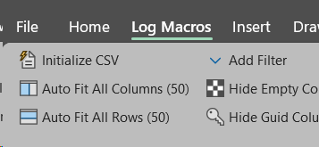
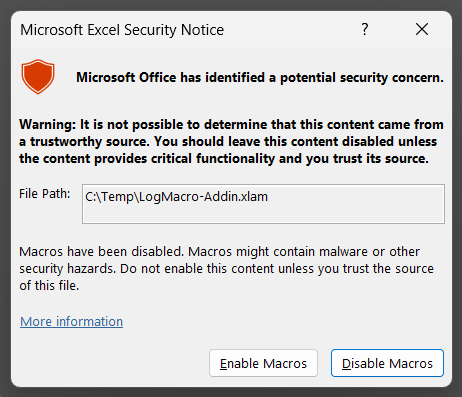
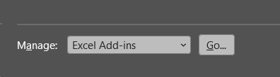
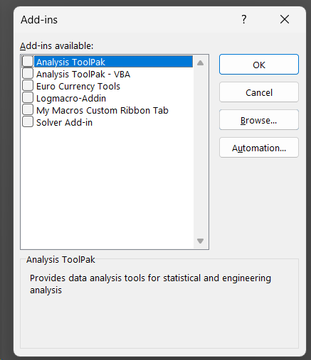
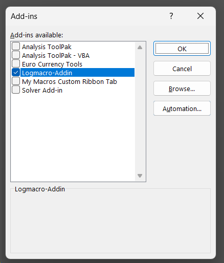
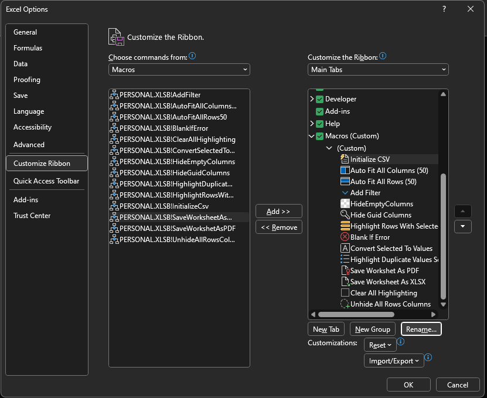
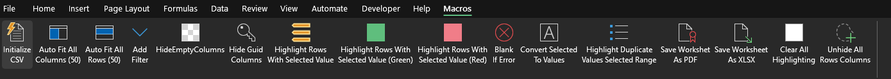
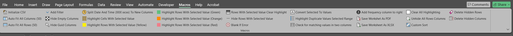
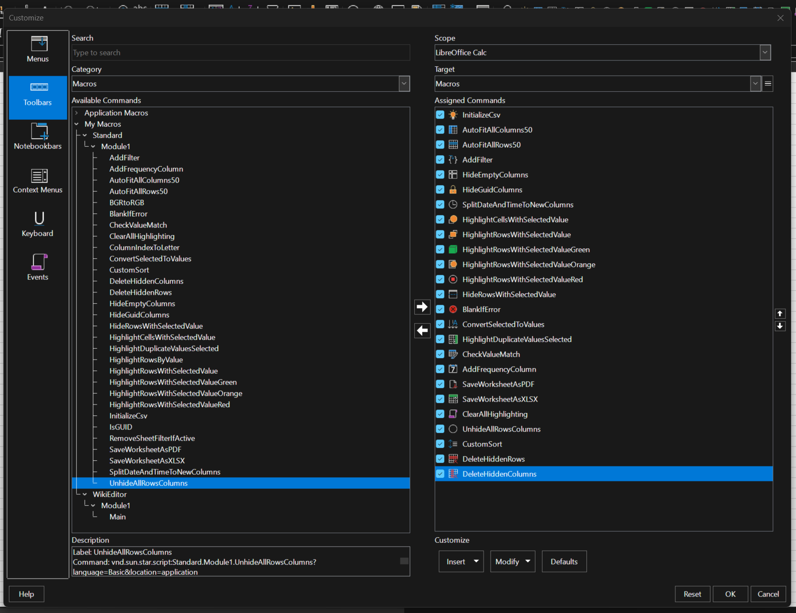

          Bitpusher
           \`._,'/
           (_- -_)
             \o/
         The Digital
             Fox
         @VinceVulpes
   https://theTechRelay.com
https://github.com/bitpusher2k

# ExcelMacros.vba - By Bitpusher/The Digital Fox

## v2.5.0 last updated 2026-07-04

## Simple Microsoft Excel macro set. Now with LibreOffice Calc version.

## Useful for manual processing of CSV log files. Includes about 40 callable macros (counting the whole-cell match variants).

### Scripts provided as-is. Use at your own risk. No guarantees or warranty provided.

# To try out Excel macros in a single worksheet (requires trust in embedded macros, remove MotW):

Download "LogMacro-Workbook.xlsm", Open it, enable macro content if prompted:

LogMacros tab should be available in the ribbon:

Copy/paste CSV data into worksheet to use macros on it.

If you encounter errors, remove the Mark of the Web; Right-click "LogMacro-Workbook.xlsm" > Properties > un-tick Unblock > OK, or from PowerShell with "Unblock-File -Path ".\LogMacro-Workbook.xlsm"

# To use Excel macros from addin (allows macros to be available to all worksheets while open/installed, already has ribbon buttons mapped, requires trust, remove MotW):

Download "LogMacro-Addin.xlam", and either open it directly via double-click (temporary use) and trust if prompted:

Or to install addin, copy it to usual Excel add-in location:
Copy-Item -Path '.\LogMacro-Addin.xlam' -Destination "$env:APPDATA\Microsoft\AddIns\" -Force

Remove the Mark of the Web; Right-click "LogMacro-Addin.xlam" > Properties > un-tick Unblock > OK, or from PowerShell with Unblock-File -Path "$env:APPDATA\Microsoft\AddIns\LogMacro-Addin.xlam"

Then Open Excel and navigate to File > Options > Add-ins > set Manage to Excel Add-ins > Go:

Click Browse, select the "LogMacro-Addin.xlam" file:

Click "Yes" to copy it to the Add-ins folder, and make sure it's ticked in Add-ins pane:

LogMacros tab should be available in the ribbon; Enable Content if prompted:

To uninstall, untick it in that same Add-ins dialog.

# To use Excel set from PERSONAL.XLSB (available to all Excel sessions, full control and review of code/icons/names as you create them):

Activate "Developer" tab in Excel to enable macro manipulation:
* https://support.microsoft.com/en-us/office/show-the-developer-tab-e1192344-5e56-4d45-931b-e5fd9bea2d45
* Right-click on the ribbon and select "Customize the Ribbon".
* In list "Main Tabs" on the right check the "Developer" box and click OK.

Save desired macros to your "Personal Macro Workbook" so they are available to all workbooks:
* Go to the "Developer" tab in a workbook.
* Click "Record Macro".
* Under "Store macro in" select "Personal Macro Workbook".
* Click "Stop Recording".
* Click the "Visual Basic" button.
* Select VBAProject "PERSONAL.XLSB".
* To use RegEx and the macro "HideGuidColumns()" go to "Tools" > "References...", check "Microsoft VBScript Regular Expression 5.5" and click "OK".
* Expand "Modules" and double-click "Module1"
* Paste desired macros from here and elsewhere into the project and save.
* Workbook "PERSONAL.XLSB" will be created in %appdata%\Microsoft\Excel\XLSTART

Alternatively, place the already created copy of PERSONAL.XLSB into %appdata%\Microsoft\Excel\XLSTART - although you should not trust strange pre-compiled macros you find on the internet.

Add desired macros as buttons to the ribbon:
* Right-clicking the ribbon > "Customize the Ribbon..."
* "New Tab", rename as desired.
* Create groups, rename as desired.
* Under "Choose commands from:" select "Macros".
* Select desired macros and arrange in group list.
* Rename & select desired icon for each macro-button.

Screenshot of Excel customization pane:

Screenshot of customized Excel ribbon buttons:

And if screen is not quite as wide it gets compressed:

If PERSONAL.XLSB does not load or becomes corrupted delete it from %appdata%\Microsoft\Excel\XLSTART and recreate. 
If PERSONAL.XLSB cannot be loaded from default location a custom location can be defined in "Options" > "Advanced" > "General" > "At startup, open all files in:"

# To use Calc set:

Method 1: Paste into My Macros (recommended - available to all documents)

* Open LibreOffice Calc
* Go to Tools > Macros > Organize Macros > Basic
* Expand My Macros & Dialogs > Standard
* Select Module1 (or create a new module)
* Click Edit to open the Basic IDE
* Paste the contents of 'CalcMacros.bas' into the module
* Save (Ctrl+S)

Method 2: Import as a new module

* Open LibreOffice Calc
* Go to Tools > Macros > Edit Macros (opens Basic IDE)
* In the project tree, right-click My Macros > Standard
* Select Insert > Module
* Name it (e.g., "CalcMacros")
* Paste the contents and save

Add Macros to Toolbar

* Go to Tools > Customize > Toolbars tab
* Click the Target dropdown and select where to add (e.g., a new toolbar)
* Click Add Command
* Under Category, expand LibreOffice Basic Macros > My Macros > Standard > Module1
* Select desired macro and click Add
* Use Modify > Rename or Change Icon to customize

Assigning Keyboard Shortcuts

* Go to **Tools > Customize > Keyboard** tab
* Select a key combination
* Under **Category**, navigate to the macro
* Click **Modify** to assign

Screenshot of Calc customization pane:

Screenshot of customized Calc ribbon buttons:

---

# List of included macros:

* InitializeCsv - Applies the "AutoFitAllColumns50", "AutoFitAllRows50", "AddFilter", "HideEmptyColumns", "HideGuidColumns" macros, and freezes the top row. Handy for initializing a CSV file for manual review.
* AutoFitAllColumns50 - Auto-fits all column width with maximum with of 50.
* AutoFitAllRows50 - Auto-fits all row height with maximum height of 50.
* AddFilter - Adds filter to top row. Easy enough to do with the Ctrl+Shift+L shortcut, but fits in with the flow when using other related macros.
* HideEmptyColumns - Hides all columns with data only in the first row (which is assumed to be the header row).
* HideGuidColumns - Hide all columns with a GUID in the second row (the first is assumed to be the header). Be sure to enable "Microsoft VBScript Regular Expression 5.5" under "Tools" > "References..." for this to work.
* SplitDateAndTimeToNewColumns - If a column containing *date* *space* *time* is selected: creates two new columns to the right, copies *date* into the first, and copies *time* into the second.
* HighlightCellsWithSelectedValue - Highlights all cells which contains the value in the currently selected cell. Can then use filter by color to limit view to highlighted entries.
* HighlightRowsWithSelectedValue - Highlights all lines that have a cell which contains the value in the currently selected cell. Can then use filter by color to limit view to highlighted entries. Separate macros for yellow/red/orange/green/cleared highlighting included.
* HideRowsWithSelectedValue - Hides all lines that have a cell which contains the value in the currently selected cell.

**Match mode (v2.5.0):** the unsuffixed selection macros above match on a partial/substring basis and are case-insensitive. A whole-cell variant of each is provided with a `Whole` suffix (e.g. `HighlightRowsWithSelectedValueWhole`, `HideRowsWithSelectedValueWhole`), which matches only cells equal to the selected value. Use the `Whole` variants for IDs, IPs, and GUIDs where a substring match would over-select (e.g. 10.0.0.5 also matching 10.0.0.51). All variants set their Find parameters explicitly, so results no longer depend on the last-used Find dialog settings.
* BlankIfError - Surround formulas in all selected cells with =IFERROR(,"").
* ConvertSelectedToValues - Converts formulas in selected cells to values.
* HighlightDuplicateValuesSelected - Highlights duplicate values in selected range of cells.
* CheckValueMatch - Compares each row of one highlighted column with values in second highlighted column and if there is a match marks "true" in a new column to the right of second column - Used for manually combining results of queries into one CSV
* AddFrequencyColumn - Creates new column to the right of selected which contains frequency of values from selected column.
* SaveWorkshetAsPDF - Saves current worksheet as PDF.
* SaveWorksheetAsXLSX - Saves current worksheet as XLSX with same path & filename as open file. Handy when processing CSV files - faster than pressing F12 > clicking Drop-down menu > clicking XLSX > clicking Save.
* ClearAllHighlighting - Clears all highlighting in the worksheet (reverts changes made by the "HighlightRowsWithSelectedValue" and "HighlightDuplicateValuesSelected" macros).
* UnhideAllRowsColumns - Un-hides all rows and columns (reverts changes made by the "HideEmptyColumns" and "HideGuidColumns" macros).
* CustomSort - Brings up the custom sort dialog (saves a couple clicks).
* DeleteHiddenRows - Deletes all currently hidden rows.
* DeleteHiddenColumns - Deletes all currently hidden columns.

# Changelog

## v2.5.0 (2026-07-04)

* Selection macros (`Highlight*`/`Hide*WithSelectedValue`) now set all Find parameters explicitly (`LookIn`/`LookAt`/`MatchCase`/`SearchOrder` in Excel, `SearchWords`/`SearchCaseSensitive`/`SearchRegularExpression` in Calc). Results are deterministic and no longer inherit the last-used Find dialog state. Ref: https://learn.microsoft.com/en-us/office/vba/api/excel.range.find
* Added whole-cell `Whole`-suffixed variants of every selection macro; the unsuffixed macros are the partial/substring, case-insensitive defaults.
* Consolidated the six near-identical highlight/hide subs into a shared engine (Excel), matching the structure the Calc port already used.
* Fixed a 32,767-row overflow in `DeleteHiddenRows` (Excel) by using `Long` for row counts.
* Added `Option Explicit` (Excel) and declared previously-undeclared loop variables.
* Performance: `HideEmptyColumns` now does a single bulk array read; `HighlightDuplicateValuesSelected` is a two-pass tally instead of per-cell `COUNTIF`; loop-heavy macros wrap work in screen/calc guards with error-safe restore.
* `HideGuidColumns` now decides on the first populated data cell per column rather than only row 2, so a blank second row no longer hides-miss a GUID column.
* `SplitDateAndTimeToNewColumns` parses common ISO 8601 text (T separator, trailing Z, +/-HH:MM offset) in addition to native datetimes, and skips-and-counts unparseable rows instead of aborting.

# Key Conversion Changes (Excel VBA to LibreOffice Basic)

| Excel VBA | LibreOffice Basic | Notes |
|---|---|---|
| `ActiveSheet` | `ThisComponent.getCurrentController().getActiveSheet()` | UNO controller model |
| `ActiveWorkbook` | `ThisComponent` | Current document |
| `Cells(row, col)` | `oSheet.getCellByPosition(col-1, row-1)` | **0-indexed** in LO |
| `Range("A1")` | `oSheet.getCellRangeByName("A1")` | Same string addressing |
| `Application.ScreenUpdating = False` | `ThisComponent.lockControllers()` | Performance optimization |
| `Selection` | `ThisComponent.getCurrentSelection()` | Returns UNO object |
| `Columns(i).Hidden = True` | `oSheet.getColumns().getByIndex(i-1).IsVisible = False` | Inverted logic |
| `Rows(j).Hidden = True` | `oSheet.getRows().getByIndex(j-1).IsVisible = False` | Inverted logic |
| `.Interior.Color = value` | `.CellBackColor = value` | BGR>RGB color conversion needed |
| `ActiveWindow.FreezePanes` | `oCtrl.freezeAtPosition(col, row)` | Direct API method |
| `Selection.AutoFilter` | `.uno:DataFilterAutoFilter` dispatch | Via DispatchHelper |
| `VBScript.RegExp` | Manual string parsing (IsGUID helper) | No COM dependency |
| `WorksheetFunction.CountIf` | COUNTIF formula or manual counting | Via cell formulas |
| `ExportAsFixedFormat xlTypePDF` | `storeToURL` with `calc_pdf_Export` filter | Filter-based export |
| `SaveAs FileFormat:=51` | `storeToURL` with `Calc MS Excel 2007 XML` filter | Filter-based export |
| `Interior.Color = xlNone` | `CellBackColor = -1` | Transparent/no color |
| `Application.CommandBars.ExecuteMso` | `.uno:DataSort` dispatch | UNO dispatch commands |

### Helper Functions (not called directly)

| Function | Description |
|---|---|
| `BGRtoRGB()` | Converts Excel BGR color Long to LibreOffice RGB color Long |
| `IsGUID()` | Validates GUID string format (replaces VBScript.RegExp dependency) |
| `ColumnIndexToLetter()` | Converts 0-based column index to letter(s) (A, B, …, Z, AA, …) |
| `HighlightRowsByValue()` | Shared implementation for all row-highlighting macros |
| `RemoveSheetFilterIfActive()` | Clears any active sheet filter (equivalent to `ShowAllData`) |

### Color Conversion Note

Excel VBA stores Long colors in **BGR** byte order (Blue×65536 + Green×256 + Red).
LibreOffice uses standard **RGB** ordering (Red×65536 + Green×256 + Blue).
All hardcoded color values have been converted accordingly. A `BGRtoRGB()` helper function
is included if you need to convert additional colors.

# References

- [LibreOffice Basic Programming Guide](https://wiki.documentfoundation.org/Macros/Basic/Calc)
- [LibreOffice API Reference](https://api.libreoffice.org/docs/idl/ref/)
- [VBA Compatibility in LibreOffice](https://help.libreoffice.org/latest/en-US/text/sbasic/shared/vbasupport.html)
- [Calc Macros Guide Ch.12](https://wiki.documentfoundation.org/images/a/a1/CG7212-CalcMacros.pdf)
- [Calc as Simple Database Ch.13 (filters)](https://wiki.documentfoundation.org/images/9/95/CG6413-CalcAsASimpleDatabase.pdf)
- [freezeAtPosition usage](https://forum.openoffice.org/en/forum/viewtopic.php?f=20&t=72745)