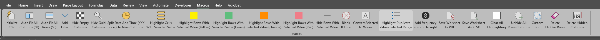

          Bitpusher
           \`._,'/
           (_- -_)
             \o/
         The Digital
             Fox
         @VinceVulpes
   https://theTechRelay.com
https://github.com/bitpusher2k

# ExcelMacros.vba - By Bitpusher/The Digital Fox

## v1.1 last updated 2024-05-04

## Simple Excel macro set.

## Useful for manual processing of CSV log files. Currently includes 14 macros.

### Scripts provided as-is. Use at your own risk. No guarantees or warranty provided.

# To use:

Activate "Developer" tab in Excel to enable macro manipulation:
* https://support.microsoft.com/en-us/office/show-the-developer-tab-e1192344-5e56-4d45-931b-e5fd9bea2d45
* Right-click on the ribbon and select "Customize the Ribbon".
* In list "Main Tabs" on the right check the "Developer" box and click OK.

Save desired macros to your "Personal Macro Workbook" so they are available to all workbooks:
* Go to the "Developer" tab in a workbook.
* Click "Record Macro".
* Under "Store macro in" select "Personal Macro Workbook".
* Click "Stop Recording".
* Click the "Visual Basic" button.
* Select VBAProject "PERSONAL.XLSB".
* To use RegEx and the macro "HideGuidColumns()" go to "Tools" > "References...", check "Microsoft VBScript Regular Expression 5.5" and click "OK".
* Expand "Modules" and double-click "Module1"
* Paste desired macros from here and elsewhere into the project and save.
* Workbook "PERSONAL.XLSB" will be created in %appdata%\Microsoft\Excel\XLSTART

Add desired macros as buttons to the ribbon:
* Right-clicking the ribbon > "Customize the Ribbon..."
* "New Tab", rename as desired.
* Create groups, rename as desired.
* Under "Choose commands from:" select "Macros".
* Select desired macros and arrange in group list.
* Rename & select desired icon for each macro-button.

Screenshot of customization pane:

Screenshot of customized Excel ribbon buttons:

Can also place an the already created copy of PERSONAL.XLSB into %appdata%\Microsoft\Excel\XLSTART - although you should not trust strange precompiled macros you find on the internet.
If PERSONAL.XLSB does not load or becomes corrupted delete it from %appdata%\Microsoft\Excel\XLSTART and recreate. 
If PERSONAL.XLSB cannot be loaded from default location a custom location can be defined in "Options" > "Advanced" > "General" > "At startup, open all files in:"

## List of included macros:
* InitializeCsv - Applies the "AutoFitAllColumns50", "AutoFitAllRows50", "AddFilter", "HideEmptyColumns", and "HideGuidColumns" macros. Handy for initializing a CSV log file for manual review.
* AutoFitAllColumns50 - Auto-fits all column width with maximum with of 50.
* AutoFitAllRows50 - Auto-fits all row height with maximum height of 50.
* AddFilter - Adds filter to top row. Easy enough to do with the Ctrl+Shift+L shortcut, but fits in with the flow when using other related macros.
* HideEmptyColumns - Hides all columns with data only in the first row (which is assumed to be the header row).
* HideGuidColumns - Hide all columns with a GUID in the second row (the first is assumed to be the header). Be sure to enable "Microsoft VBScript Regular Expression 5.5" under "Tools" > "References..." for this to work.
* SplitDateAndTimeToNewColumns - If a column containing *date* *space* *time* is selected: creates two new columns to the right, copies *date* into the first, and copies *time* into the second.
* HighlightRowsWithSelectedValue - Highlights all lines that have a cell which contains the value in the currently selected cell. Can then use filter by color to limit view to highlighted entries. Separate macros for yellow/green/red highlighting included.
* BlankIfError - Surround formulas in all selected cells with =IFERROR(,"").
* ConvertSelectedToValues - Converts formulas in selected cells to values.
* HighlightDuplicateValuesSelected - Highlights duplicate values in selected range of cells.
* SaveWorkshetAsPDF - Saves current worksheet as PDF.
* SaveWorksheetAsXLSX - Saves current worksheet as XLSX with same path & filename as open file. Handy when processing CSV files - faster than pressing F12 > clicking Drop-down menu > clicking XLSX > clicking Save.
* ClearAllHighlighting - Clears all highlighting in the worksheet (reverts changes made by the "HighlightRowsWithSelectedValue" and "HighlightDuplicateValuesSelected" macros).
* UnhideAllRowsColumns - Un-hides all rows and columns (reverts changes made by the "HideEmptyColumns" and "HideGuidColumns" macros).

Would like to create version of macro set that works with LibreOffice at some point, but that will require some work.